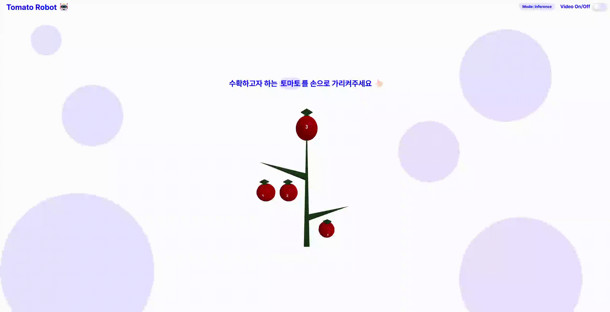

# tomato-robot-demo
Real-time hand gesture detection and robot control demo system

## Project Structure

The project is organized as follows:
- `script/`: Scripts for running the demo
- `src/`: Source code
  - `hand_gesture/`: Code for hand gesture recognition
  - `indy_robot/`: Code for robot control
- `Pipfile` and `Pipfile.lock`: Python dependency management

## Installation

### Prerequisites
- Python 3.10
- pipenv (for dependency management)

### Setup
1. Clone the repository:
   ```
   git clone https://github.com/seoooa/tomato-robot-demo.git
   cd tomato-robot-demo
   ```

2. Install dependencies using pipenv:
   ```
   pipenv install
   ```

3. Activate the virtual environment:
   ```
   pipenv shell
   ```

## Demo

### Tomato Robot App
   Execute `tomato_robot_app.py` in the `script`
   ```
   python script/tomato_robot_app.py
   ```

   <div align=center>
   <p align="center">

   #### Preview
   
   
   </p>
   </div>